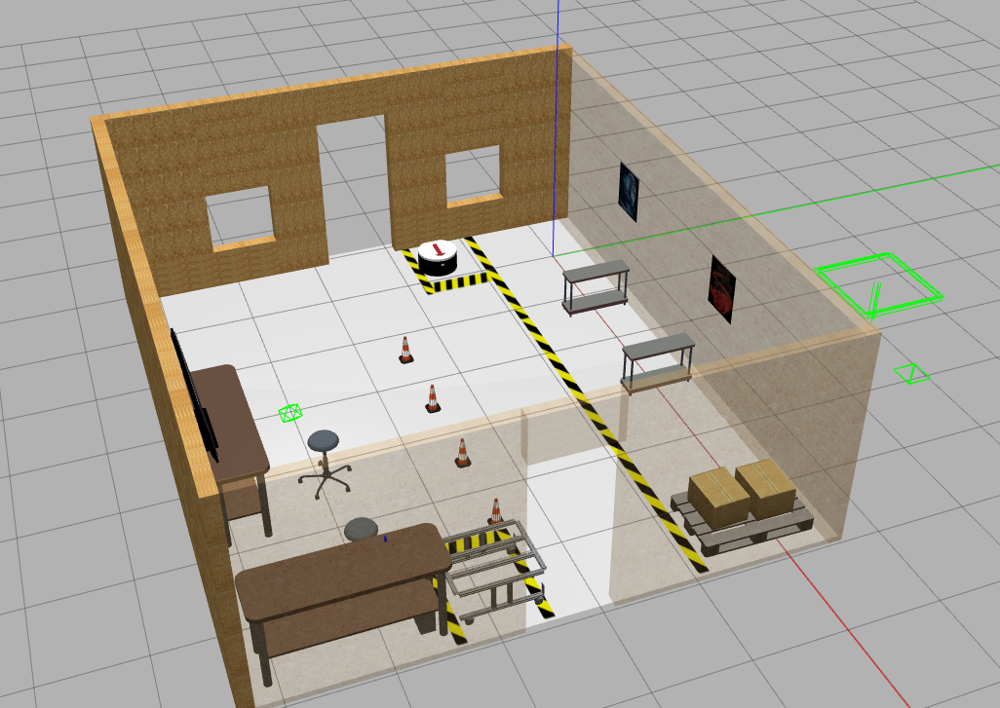
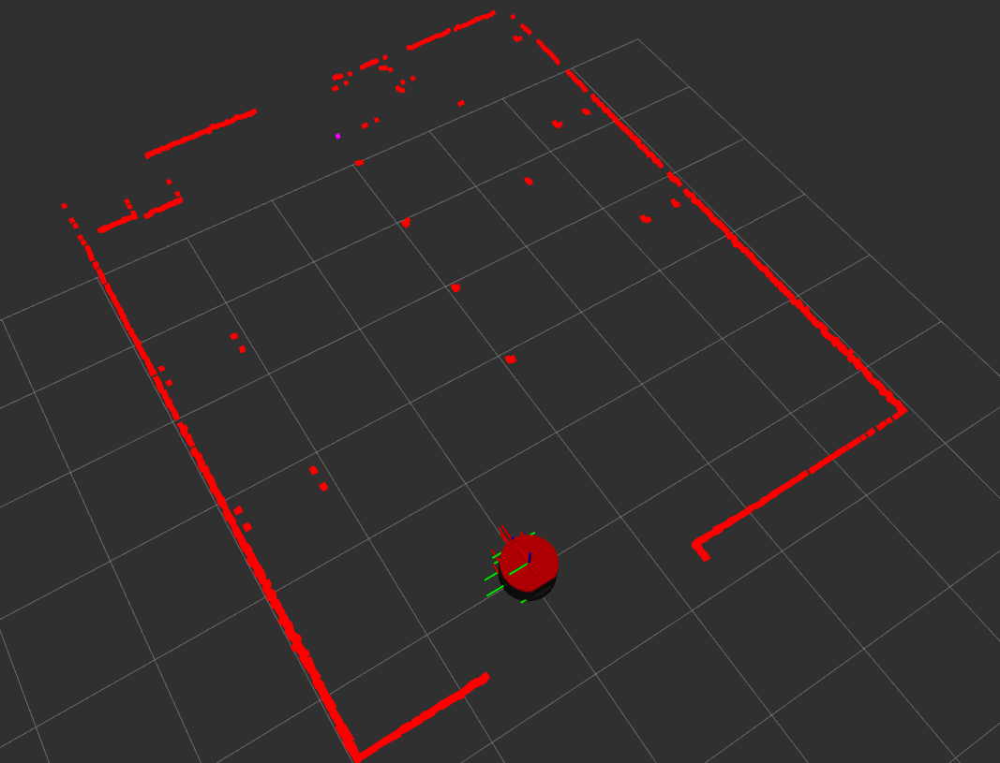

<sub>🌐 [English](README.md) · **Español**</sub>

# Robot RB1: simulación de almacén (ROS 2 Humble + Gazebo + Docker)

Simulación en Gazebo del **robot móvil RB1** dentro de un almacén, para ROS 2 Humble. Es la simulación que
usa [rb1_autonomy](https://github.com/morg1207/rb1_autonomy) (Nav2 + árboles de comportamiento) y se puede
ejecutar de forma nativa o en un contenedor con **Docker Compose**.

| Gazebo | RViz |
|---|---|
|  |  |

## 1. Instalación nativa

### 1.1 Compilar
```bash
# Clonar el repositorio
mkdir -p ~/rb1_ws/src
cd ~/rb1_ws/src
git clone https://github.com/morg1207/warehouse_rb1_sim.git

# Instalar dependencias
sudo apt update
cd ~/rb1_ws
rosdep init
rosdep update --rosdistro $ROS_DISTRO
rosdep install -i --from-path src --rosdistro $ROS_DISTRO -y

# Compilar
source /opt/ros/humble/setup.bash
colcon build --symlink-install
```

### 1.2 Lanzar la simulación
```bash
cd ~/rb1_ws
source install/setup.bash
ros2 launch the_construct_office_gazebo warehouse_rb1_rviz.launch.xml
```

## 2. Docker

Un entorno con Docker Compose que ejecuta la simulación del RB1 en Gazebo con ROS 2 Humble y muestra la
interfaz gráfica en el equipo anfitrión (X11 / WSLg).

### 2.1 Archivos

| Archivo | Para qué sirve |
|---|---|
| `dockerfile` | Construye la imagen: ROS 2 Humble, Gazebo 11, ros2_control, RViz y este repositorio. |
| `docker-compose.yml` | Ejecuta el contenedor con acceso a la pantalla del anfitrión. |
| `scripts/docker_install.sh` | Instala Docker. |
| `scripts/build.sh` | Construye el entorno de Docker Compose. |
| `scripts/run.sh` | Ejecuta el contenedor. |
| `scripts/stop.sh` | Detiene y elimina el contenedor. |

### 2.2 Pasos

**Instalar Docker**
```sh
source scripts/docker_install.sh
```

**Construir la imagen**
```sh
xhost +local:root
export DISPLAY

mkdir -p ~/dockers && cd ~/dockers
git clone https://github.com/morg1207/warehouse_rb1_sim.git
cd ~/dockers/warehouse_rb1_sim
docker compose build
```

**Ejecutar el contenedor**
```sh
cd ~/dockers/warehouse_rb1_sim
docker compose up
```

**Detener el contenedor**
```sh
source scripts/stop.sh
```

**Reconstruir la imagen sin caché** (para traer la última versión de este repositorio)
```sh
docker build -t warehouse_rb1_sim --build-arg CACHEBUST=$(date +%s) .
```

## Agradecimientos

Este repositorio se basa en una simulación de [The Construct](https://www.theconstruct.ai/). Agradezco su
trabajo y sus recursos educativos, que fueron fundamentales para desarrollarlo.


