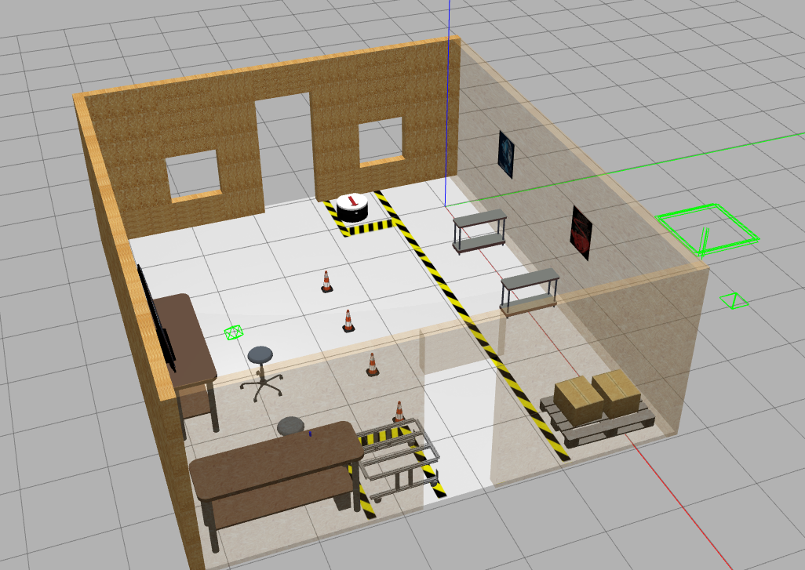
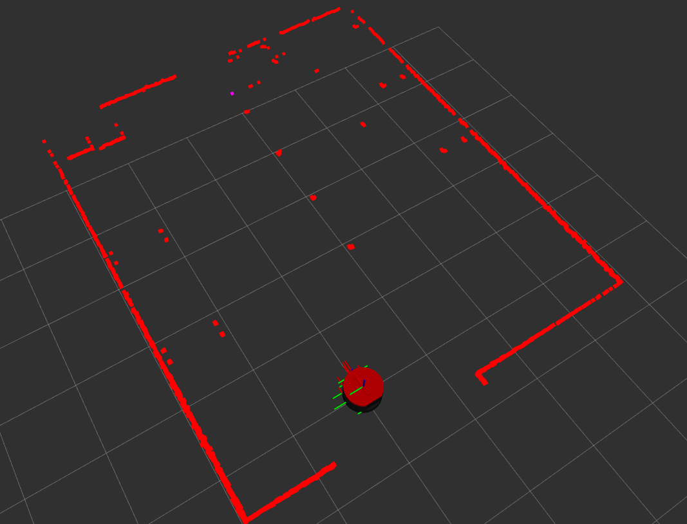

# RB1 Robot and Warehouse Simulation


## 1. Simulación

### 1.1. Configuración
```bash
# Descargar repositorio
mkdir -p ~/rb1_ws/src
cd ~/rb1_ws/src
git clone https://github.com/morg1207/warehouse_rb1_sim.git

# Actualizar dependencias
sudo apt update
cd ~/rb1_ws
rosdep init
rosdep update --rosdistro $ROS_DISTRO
rosdep install -i --from-path src --rosdistro $ROS_DISTRO -y

# Compilar
cd ~/rb1_ws
source /opt/ros/humble/setup.bash 
colcon build --symlink-install
```

### 1.2 Lanzar simulacón
Terminal 1 
```bash
cd ~/rb1_ws
source install/setup.bash
ros2 launch the_construct_office_gazebo warehouse_rb1_rviz.launch.xml
```
output rviz

  

output gazebo

  


## 2. Docker
A Docker Compose setup for simulating the RB1 robot in Gazebo with ROS2 Humble.

### 2.1 Files Explained

- `docker-compose.yml`: The Docker Compose file that configures and runs the container.
- `Dockerfile`: The Dockerfile to build the Docker image.
- `build.sh`: Builds the Docker Compose setup.
- `run.sh`: Runs the container.
- `stop.sh`: Stops the container.

### 2.2 Steps to Run

Run the following commands:


#### 2.2.1 Install Docker

```sh
source docker_install.sh
```

#### 2.2.2 Build image

```sh
xhost +local:root
export DISPLAY

# Docker build  and run
cd 
mkdir dockers
cd ~/dockers
git clone git@github.com:morg1207/warehouse_rb1_sim.git
cd ~/dockers/warehouse_rb1_sim 
docker compose build 
```

#### 2.2.3 Run the container

```sh
cd ~/dockers/warehouse_rb1_sim 
docker compose up
```

#### 2.2.4 Stop the container

```sh
source scripts/stop.sh

```

#### 2.2.5 Reconstruir la imagen en el cache 

```sh
docker build -t warehouse_rb1_sim --build-arg CACHEBUST=$(date +%s) .

```

